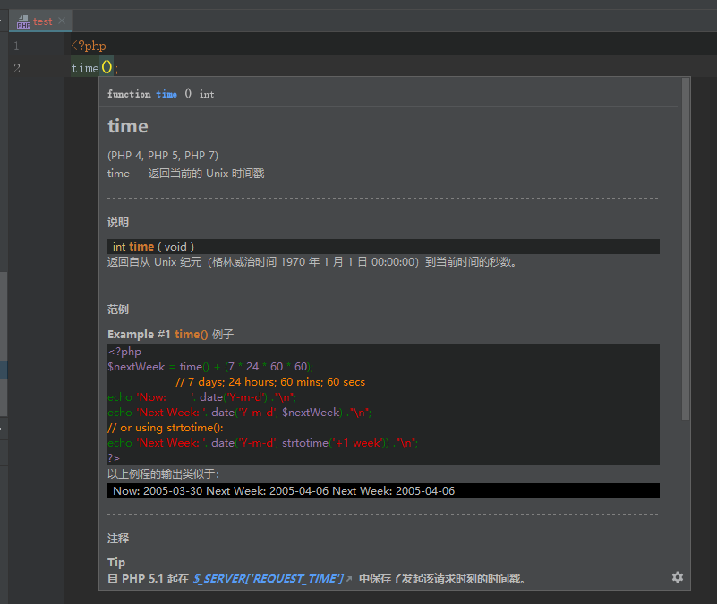
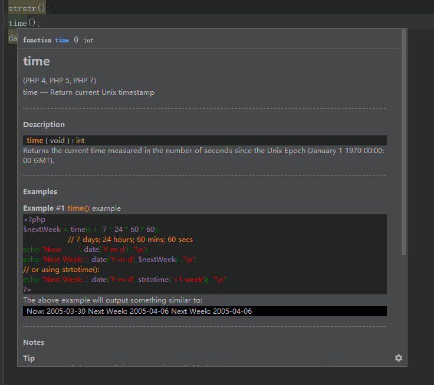
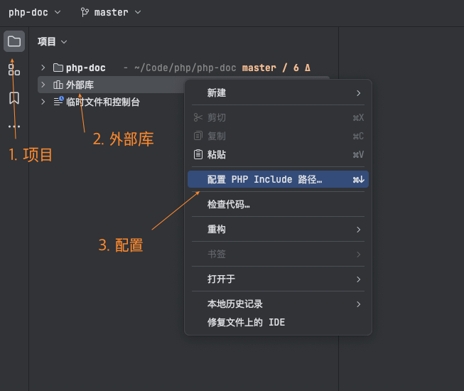
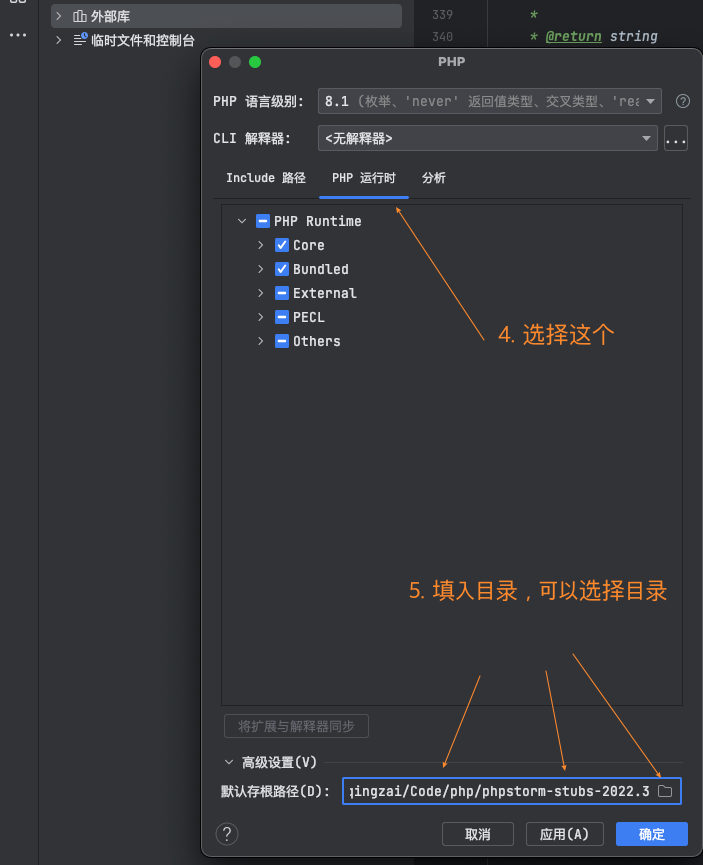
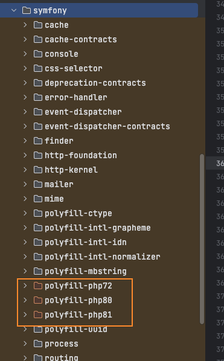
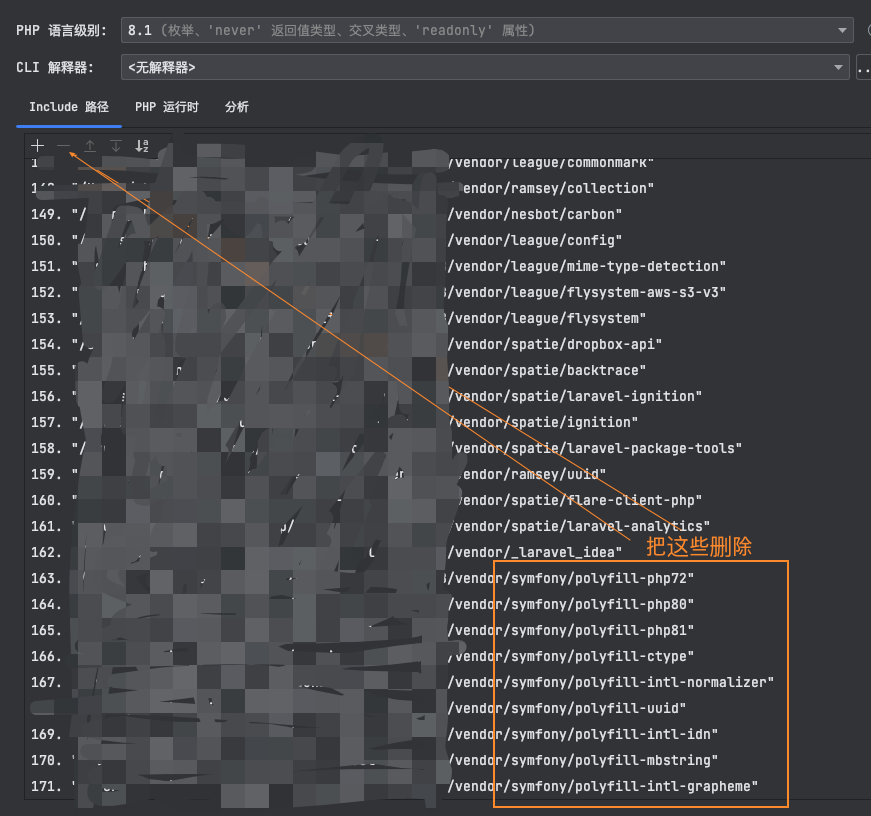
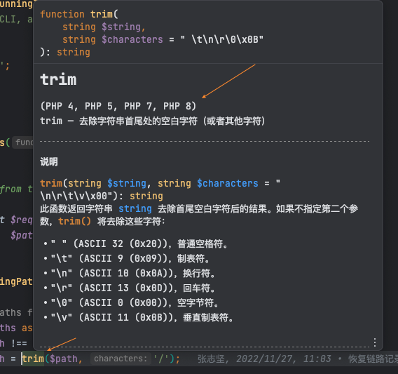
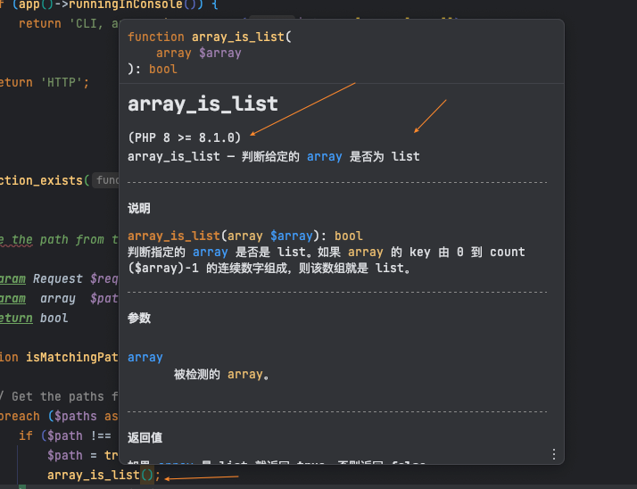

## 介绍

在代码上快速查看php基本函数的中文文档和使用示例, 默认快捷键ctrl+q.

// 如果ctrl+q快捷键没有反应,打开File->setting->keymap 搜索quick document,查看你的快捷键是什么,也可以自己设置

## 安装

在线安装:   在phpstorm的插件中心搜索chinese php document, 点击安装    
//该方法有可能会无效,如有问题请点击External Libraries->PHP Runtime->右键->Configure PHP Runtime修改下PHP language level点应用触发更新, 或使用离线安装方法安装

离线安装:   下载项目下的/document/phpdoc-cn.zip文件,解压. 然后点击phpstorm->project->External Libraries->PHP Runtime->右键->Configure PHP Runtime->Advanced Setting->Default Stub Paths->指向解压文件的目录
//使用该方法可以编辑存根, 可以在方法上添加自己的笔记

## introduction. 

Quickly view the Chinese documentation and usage examples of php basic functions on the code. Default shortcut key ctrl+q. 

// if the ctrl+q shortcut does not respond, open File- > setting- > keymap and search quick document, to see what your shortcut key is, or you can set it yourself. 

## installation. 

Online installation:    search for Chinese PHP document in the plug-in center of phpstorm and click Install.
//This method may be invalid. If there is a problem, please click external libraries - > PHP runtime - > right click - > configure PHP runtime to modify the PHP language level and click apply to trigger the update, or use the offline installation method to install


Offline installation:   Download /document/phpdoc-en.zip file, unzip Then click phpstorm -> Project -> external libraries -> PHP runtime -> right click -> configure PHP runtime -> advanced setting -> Default stub paths -> point to the directory of the extracted file
//Using this method, you can edit the stub and add your own notes on the method
        
## 示例/example

 
 

## [制作过程/Documentation process](./develop.MD).


## 制作文档教程

### 下载PHP对应语言文档

> PHP文档下载地址：[download-docs.php](https://www.php.net/download-docs.php)
>
> 根据需要的语言文档下载
>
> **注意：下载时，下载多页面( `Many HTML files` )版本**


### 下载PhpStorm默认文档

> PhpStorm 文档下载地址：[phpstorm-stubs/releases](https://github.com/JetBrains/phpstorm-stubs/releases)
>
> 需要下载 PhpStorm 默认英文文档进行处理，根据自己安装的版本下载对应的文档版本


### 文档处理

1. 把下载的文档全部移动到 `raw/` 目录下，并解压

   ```shell
   # 示例
   
   # 进入项目目录
   # cd 项目目录
   
   # 移动 php 文档
   mv Download/php_manual_zh.tar.gz ./raw/
   # 移动 phpStorm 文档
   mv Download/phpstorm-stubs-2022.3.zip ./raw/
   
   # 解压 - 自行解压吧
   # 解压得到文件夹
   # 1. phpstorm-stubs-2022.3    -- phpstorm文档
   # 2. php-chunked-xhtml 				-- php官方文档
   ```

2. 修改文件常量

   ```php
   // 需要修改 doc_handler/attacher.php 文件中 \docOut 常量值，修改为刚刚解压出来的 phpstorm 对应版本文档目录
   
   const docOut = __DIR__.'/../raw/phpstorm-stubs-2022.3/';
   ```

3. 进行文档处理

   > 注意：建议 php版本是 7

   ```shell
   # 1. 进入文档处理程序目录
   cd doc_handler
   
   # 2. 处理 php文档文件
   php handler.php
   
   # 3. 处理 phpstorm文档文件 
   php attacher.php
   ```

4. 删除多于的文件

   ```shell
   # phpstorm-stubs-2022.3/ 目录下的文档已经处理完成，但是有些多于的文件是不需要的，需要删除
   # 查看目录下，把 非目录的文件 删除即可
   cd ../raw/phpstorm-stubs-2022.3/
   
   # 查看文件
   ls -al
   
   # Linux
   #ls --file-type | grep -v /$ | xargs rm -f
   
   # Mac | Linux - 如果是 Linux 需要检查下面的 $9 是否为文件名
   l -al | awk '{print $1, $9}' | grep -v '^d' | awk '{print $2}' | xargs rm -f
   
   # 再次查看文件
   ls -al
   ```


## 文档安装

> 经过处理的文档目录 `phpstorm-stubs-2022.3` 已经是 `ok` 的 PhpStorm中文文档，但是还需要安装进去 `PhpStorm`
>
> ⚠️警告：如果你的 PhpStorm 已经安装中文文档插件 `chinese php document` ，则需要先卸载，然后重启 `PhpStorm`

1. 保存文档目录

   **注意：最好把 `phpstorm-stubs-2022.3/` 移至一个可保存不变动的目录，并且目录必须保持全英文路径，避免不必要的麻烦**

   ```shell
   mv phpstorm-stubs-2022.3 ~/phpstorm-stubs-2022.3
   ```

2. 设置引入目录

   重启启动 `IDE` 

   中文菜单栏操作：phpStorm -> 右边项目菜单栏，选中 外部库 -> 右键 -> 配置 PHP Include 路径 -> 选中 PHP 运行时 -> 选择底部高级设置 ->  设置默认存根路径，选择刚刚的 `phpstorm-stubs-2022.3` 所在目录 -> 应用，确认 -> 等待加载IDE索引  -> 重启 IDE

   英文菜单栏操作：phpStorm -> project -> External Libraries -> 右键 -> Configure PHP Runtime -> Advanced Setting -> Default Stub Paths -> 选择刚刚的 `phpstorm-stubs-2022.3` 所在目录 -> 应用，确认 -> 等待加载IDE索引  -> 重启 IDE

   

   

3. 排除 `symfony` 的扩展文件
   
   > 如果你的php版本已经是 `8.1+ ` 无需使用 `symfony` 的扩展文件，否则 `phpStorm` 无法识别该采用那个文档
   
   
   
   
   
3. 检查
   
   ```php
   // 在 php 文件编写系统函数，然后把鼠标移到该函数上，注释就会出来，看看是不是已经是中文版本文档
   trim()
   array_is_list()
   ```
   
   
   
   
   
   
