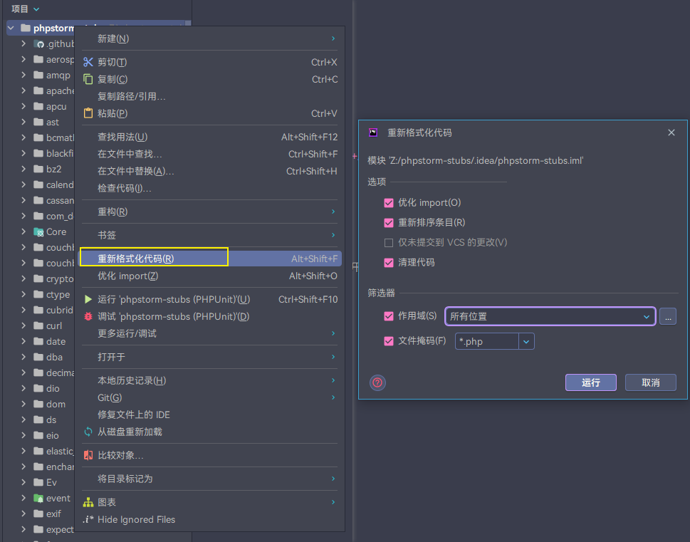
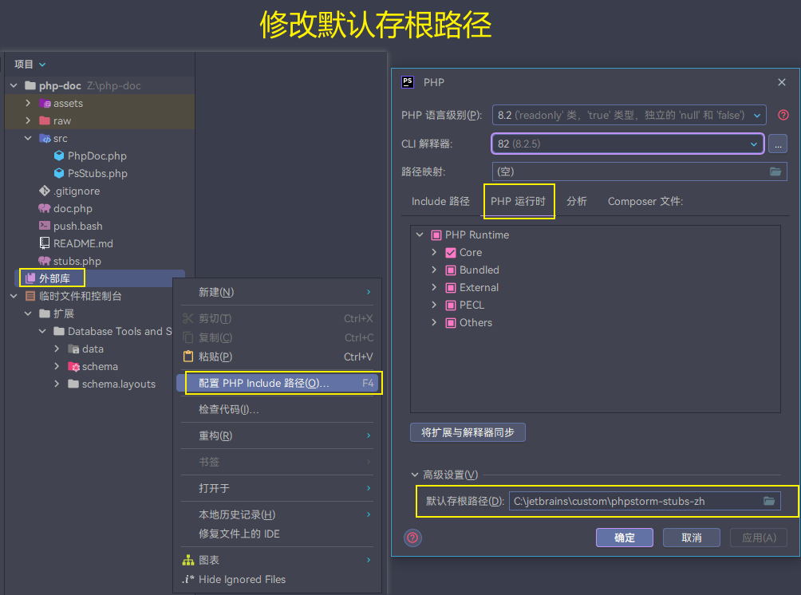
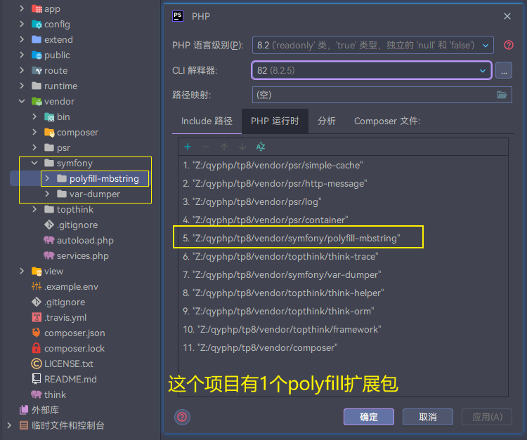
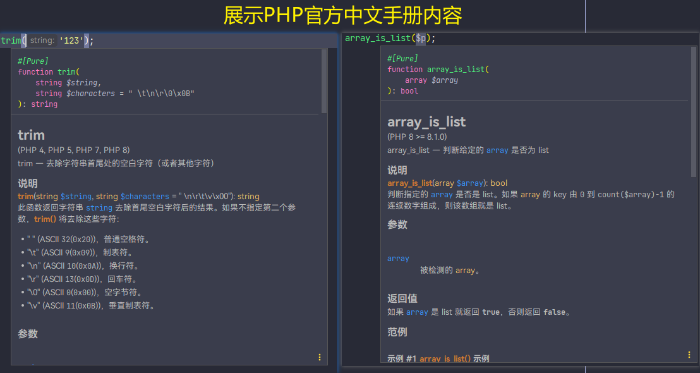

## PsStubs 追加 PhpDoc

项目基于 php8.2 开发，功能是将 PHP 官方手册内容合并到 `phpstorm-stubs`

- 实现部分：类名、接口名、特性名、方法(大部分)、函数(大部分)、预定义变量、魔术常量、常量(大部分)
- 未实现部分：属性

下面是文档具体制作过程：

## 1. 下载PHP对应语言文档

根据自己使用的语言下载文档，这里使用[PHP中文文档](https://www.php.net/distributions/manual/php_manual_zh.tar.gz)

> 注意：下载时，下载多页面( `Many HTML files` )版本

## 2. 下载 PhpStorm-stubs

需要下载 PhpStorm 官方默认的 [PhpStorm-stubs](https://github.com/JetBrains/phpstorm-stubs/releases) 进行增量处理

> 注意：对于 `PhpStorm-stubs` 低版本，需根据 PhpStorm 版本下载 github 上对应的标签，较新版本使用 master 分支即可

> 警告：必须使用 phpstrom 将整个 `PhpStorm-stubs` 项目进行代码格式化



## 3. 处理文档

通过php脚本将php中文文档的内容转成phpstorm官方文档格式（这是增强版本）

1. 把下载的文档全部移动到 `raw` 目录下，并解压：

   ```shell
   # 1. 进入项目根目录
   cd /server/www/php-doc/raw/
   # 2. 解压PHP手册，得到 php-chunked-xhtml 目录
   tar -xzf php_manual_zh.tar.gz
   # 3. 解压 phpstorm-stubs 
   unzip phpstorm-stubs-master.zip
   mv phpstorm-stubs-master/ phpstorm-stubs/
   ```

   > 解压得到文件夹：

   ```text
   phpstorm-stubs           -- phpstorm-stubs文档
   php-chunked-xhtml        -- php官方文档
   ```

2. 删除多于的文件

   ```shell
   # phpstorm-stubs/ 目录下的文档已经处理完成，但是有些多于的文件是不需要的，需要删除
   # 查看目录下，把 非目录的文件 删除即可
   cd /server/www/php-doc/raw/phpstorm-stubs/
   # Linux
   ls -a --file-type | grep -v /$ | xargs rm -f
   rm -rf .github/ .idea/
   ```

   > 提示：这些文件在不影响性能的情况下，可不用移除，因为不确定是否有用

3. 进行文档处理

   ```shell
   # 1. 进入项目根目录
   cd /server/www/php-doc/
   # 2. 处理 php官方文档
   php doc.php
   # 3. 处理phpstorm-stubs 
   php stubs.php
   ```

   > 提示：项目基于php8.2开发，推荐使用 php8.2 版本来批处理

## 5. 文档引入phpstorm

经过处理的文档目录 `phpstorm-stubs` 已经是 `ok` 的 PhpStorm中文文档，但是还需要安装进去 `PhpStorm`

> ⚠️警告：如果你的 PhpStorm 已经安装中文文档插件 `chinese php document` ，则需要先卸载，然后重启 `PhpStorm`

1. 保存文档目录

   注意：最好把 `phpstorm-stubs` 移至一个可保存不变动的目录，并且目录必须保持全英文路径，避免不必要的麻烦**

2. 设置引入目录

   重启启动 `IDE`

   中文菜单栏操作：phpStorm -> 右边项目菜单栏，选中 外部库 -> 右键 -> 配置 PHP Include 路径 -> 选中 PHP 运行时 ->
   选择底部高级设置 ->  设置默认存根路径，选择刚刚的 `phpstorm-stubs` 所在目录 -> 应用，确认 -> 等待加载IDE索引 ->
   重启 IDE

   英文菜单栏操作：phpStorm -> project -> External Libraries -> 右键 -> Configure PHP Runtime -> Advanced Setting ->
   Default Stub Paths -> 选择刚刚的 `phpstorm-stubs` 所在目录 -> 应用，确认 -> 等待加载IDE索引 -> 重启 IDE

   

3. 排除 `symfony` 的扩展文件

   > 如果你的 PHP 是最新版则无需使用 symfony 的 `polyfill 扩展`，否则 PhpStorm 无法识别该采用那个文档

   

4. 检查

   ```php
   // 在 php 文件编写系统函数，然后把鼠标移到该函数上，注释就会出来，看看是不是已经是中文版本文档
   trim()
   array_is_list()
   ```

   
