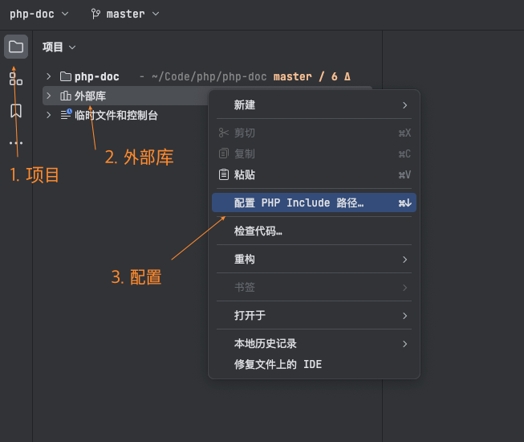
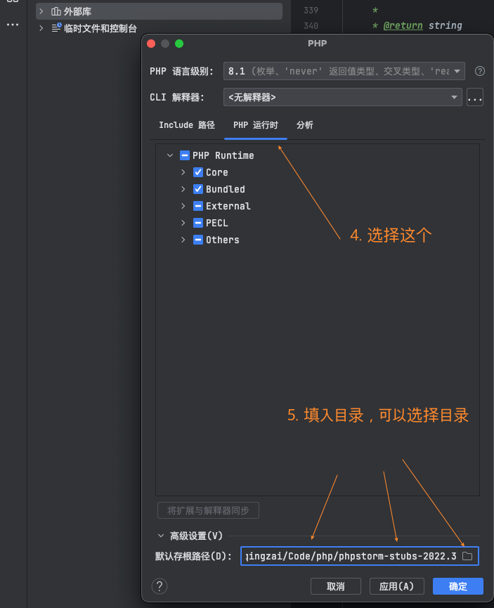
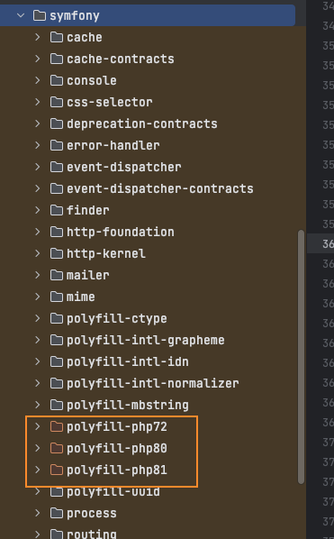
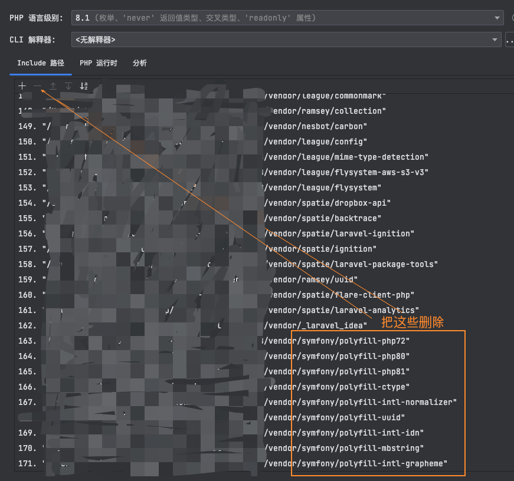
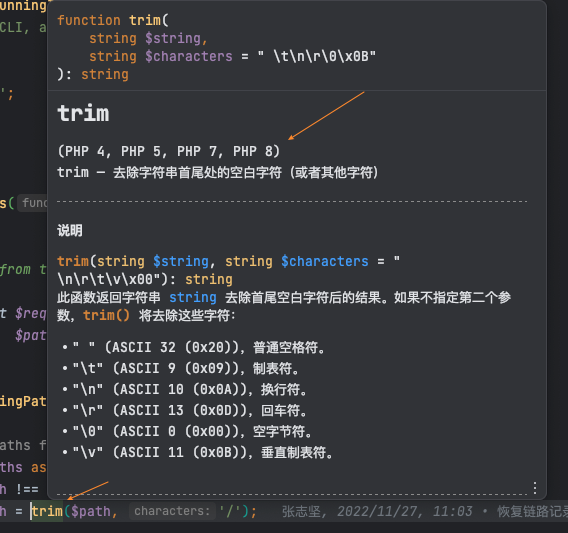
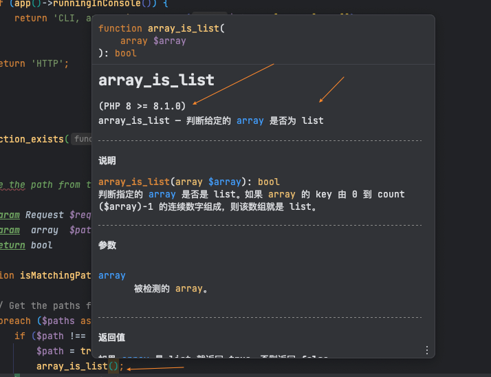

## 介绍

源码从 https://github.com/fw6669998/php-doc/ 拷贝，代码做过修复，以适合 `phpstorm-stubs-2023.2.3` 

下面是文档具体制作过程：

## 1. 下载PHP对应语言文档

根据自己使用的语言下载文档

PHP中文文档下载地址：[php_ma****nual_zh](https://www.php.net/distributions/manual/php_manual_zh.tar.gz)

> 注意：下载时，下载多页面( `Many HTML files` )版本

## 2. 下载PhpStorm默认文档

需要下载 PhpStorm 官方默认文档进行处理，文档需根据自己安装的phpstorm版本下载对应的phpstorm文档版本

> phpstorm 官方文档下载地址：[phpstorm-stubs/releases](https://github.com/JetBrains/phpstorm-stubs/releases)

## 3. 处理文档

通过php脚本将php中文文档的内容转成phpstorm官方文档格式（这是增强版本）

1. 把下载的文档全部移动到 `raw` 目录下，并解压：

   ```shell
   # 1. 进入项目根目录
   cd /server/www/php-doc/raw/
   # 2.1 移动 php 文档
   mv path/php_manual_zh.tar.gz ./
   # 2.2 移动 phpStorm 文档
   mv path/phpstorm-stubs-2022.3.tar.gz ./
   # 3. 解压
   tar -xzf php_manual_zh.tar.gz
   mv ./php_manual_zh/php-chunked-xhtml ./php-chunked-xhtml
   tar -xzf phpstorm-stubs-2022.3.tar.gz
   mv phpstorm-stubs-2022.3/ phpstorm-stubs/
   ```

   > 解压得到文件夹：

   ```text
   phpstorm-stubs           -- phpstorm-stubs文档
   php-chunked-xhtml        -- php官方文档
   ```

2. 修改文件常量

   ```php
   # doc_handler/attacher.php 中常用 docOut 改成phpstorm对应版本文档的路径
   const docOut = __DIR__ . '/../raw/phpstorm-stubs/';
   ```

3. 进行文档处理

   > 注意：推荐使用 php7.x 版本，亲测：
   > - 使用 php8.2 会打印非常多的警告
   > - 使用 php7.4 正常执行

   ```shell
   # 1. 进入项目根目录
   cd /server/www/php-doc/
   # 2. 处理 php官方文档
   php doc.php
   # 3. 处理phpstorm-stubs 
   php stubs.php
   ```

4. 删除多于的文件

   ```shell
   # phpstorm-stubs/ 目录下的文档已经处理完成，但是有些多于的文件是不需要的，需要删除
   # 查看目录下，把 非目录的文件 删除即可
   cd /server/www/php-doc/raw/phpstorm-stubs/
   # Linux
   ls -a --file-type | grep -v /$ | xargs rm -f
   rm -rf .github/ .idea/
   cd ../
   mv phpstorm-stubs/ phpstorm-stubs-zh/
   tar -cJf phpstorm-stubs-zh.tar.xz phpstorm-stubs-zh/
   ```

## 5. 文档引入phpstorm

经过处理的文档目录 `phpstorm-stubs` 已经是 `ok` 的 PhpStorm中文文档，但是还需要安装进去 `PhpStorm`

> ⚠️警告：如果你的 PhpStorm 已经安装中文文档插件 `chinese php document` ，则需要先卸载，然后重启 `PhpStorm`

1. 保存文档目录

   注意：最好把 `phpstorm-stubs/` 移至一个可保存不变动的目录，并且目录必须保持全英文路径，避免不必要的麻烦**

2. 设置引入目录

   重启启动 `IDE`

   中文菜单栏操作：phpStorm -> 右边项目菜单栏，选中 外部库 -> 右键 -> 配置 PHP Include 路径 -> 选中 PHP 运行时 ->
   选择底部高级设置 ->  设置默认存根路径，选择刚刚的 `phpstorm-stubs` 所在目录 -> 应用，确认 -> 等待加载IDE索引 ->
   重启 IDE

   英文菜单栏操作：phpStorm -> project -> External Libraries -> 右键 -> Configure PHP Runtime -> Advanced Setting ->
   Default Stub Paths -> 选择刚刚的 `phpstorm-stubs` 所在目录 -> 应用，确认 -> 等待加载IDE索引 -> 重启 IDE

   

   

3. 排除 `symfony` 的扩展文件

   > 如果你的php版本已经是 `8.1+ ` 无需使用 `symfony` 的扩展文件，否则 `phpStorm` 无法识别该采用那个文档

   

   

3. 检查

   ```php
   // 在 php 文件编写系统函数，然后把鼠标移到该函数上，注释就会出来，看看是不是已经是中文版本文档
   trim()
   array_is_list()
   ```

   

   
   
   
